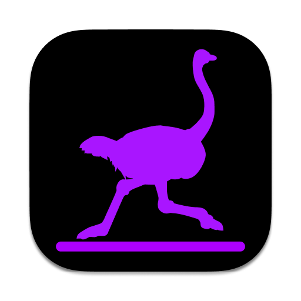

<h1 align="center">
  <br>
  
  <br>
  nostr-relay-tray
  <br>
  <br>
</h1>

<h4 align="center">A simple nostr relay tray. For Mac, Windows, and Linux. </h4>

<p align="center">powered by <a href="https://github.com/CodyTseng/nostr-relay">nostr-relay</a></p>

## Download

You can download the latest version from the [release page](https://github.com/CodyTseng/nostr-relay-tray/releases).

Because the app is not signed, you may need to allow it to run in the system settings.

## Build from source

You can also build the app from the source code.

```bash
# Clone this repository
git clone https://github.com/CodyTseng/nostr-relay-tray.git

# Go into the repository
cd nostr-relay-tray

# Install dependencies
npm install

# Build the app
npm run build:mac
# or npm run build:win
# or npm run build:linux
```

The executable file will be in the `out` folder.

## Screenshot


## Donate

If you like this project, you can buy me a coffee :) ⚡️ codytseng@getalby.com ⚡️

## Icon Attribution

The ostrich element within the icon is sourced from [nostr_icons](https://github.com/satscoffee/nostr_icons). Special thanks to satscoffee for providing such a beautiful ostrich.

## License

MIT
