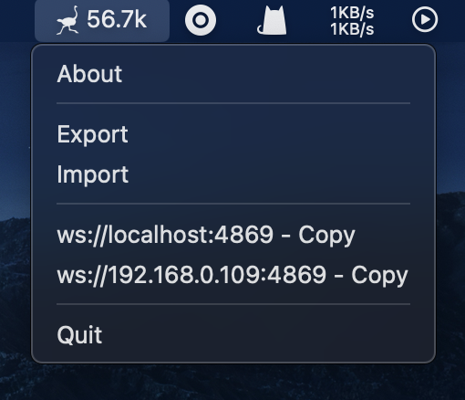

# nostr-relay-tray

A simple nostr relay tray.

Powered by [nostr-relay](https://github.com/CodyTseng/nostr-relay).



## Download

You can download the latest version from [here](https://github.com/CodyTseng/nostr-relay-tray/releases).

Because the app is not signed, you may need to allow it to run in the system settings.

## Build from source

```bash
git clone https://github.com/CodyTseng/nostr-relay-tray.git
cd nostr-relay-tray
npm install
npm run make
```

The executable file will be in the `out` folder.

## Donate

If you like this project, you can buy me a coffee :) ⚡️ codytseng@getalby.com ⚡️

## License

MIT
