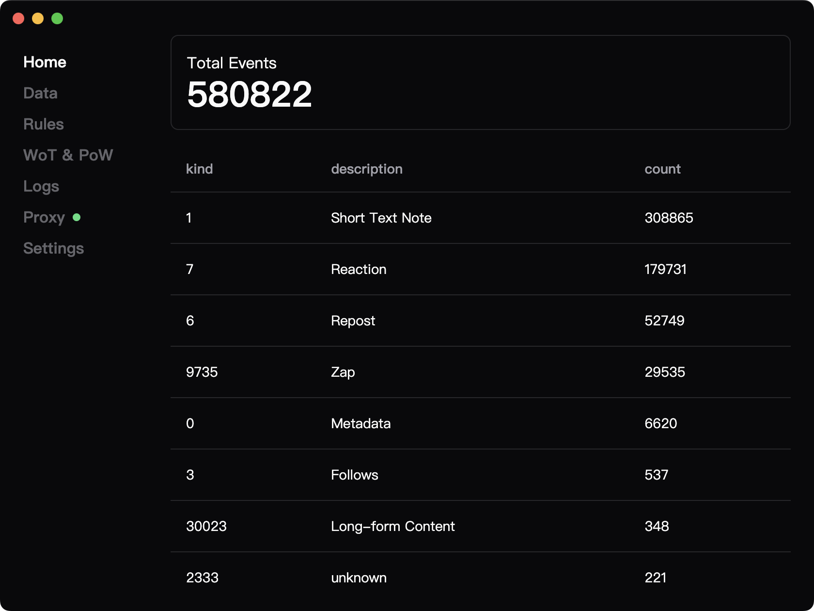
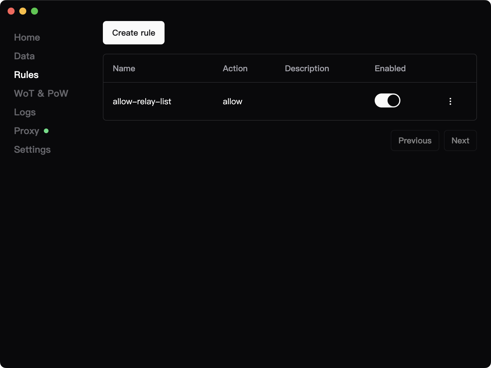
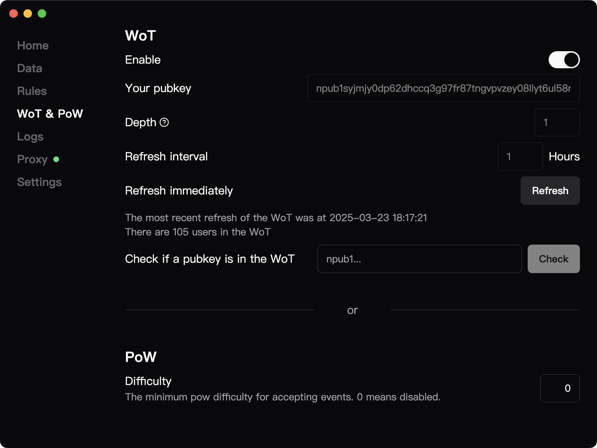
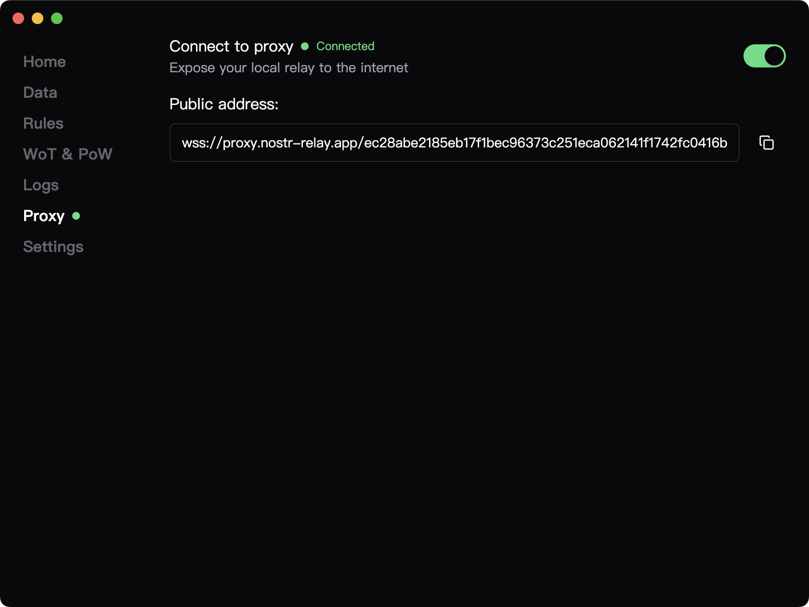

<h1 align="center">
  <br>
  
  <br>
  nostr-relay-tray
  <br>
  <br>
</h1>

<h4 align="center">A nostr relay for desktop, available on macOS, Windows, and Linux.</h4>

<p align="center">powered by <a href="https://github.com/CodyTseng/nostr-relay">nostr-relay</a></p>
 
## Features

- **Fully Featured** – A complete Nostr relay with all essential functionalities.
- **Zero-Config Start** – Instantly launch your own relay.
- **Granular Control** – Precisely manage which events to accept or reject.
- **Instant Public Access** – Open your relay to the world with a single click.
- **Full-Text Search** – Quickly find events with powerful search capabilities.
- **Cross-Platform** – Available on macOS, Windows, and Linux.

## Download

Download the latest release from the [Releases page](https://github.com/CodyTseng/nostr-relay-tray/releases).

> **Note:** Since the app is unsigned, you may need to manually allow it to run in your system settings.

### Running on Apple Silicon

If you encounter the error: "nostr-relay-tray is damaged and can't be opened. You should move it to the Bin.", run the following command in your terminal:

```bash
sudo xattr -rd com.apple.quarantine /Applications/nostr-relay-tray.app
```

Then, try launching the app again.

## Build from source

You can also compile the app from source.

> Note: Node.js >= 20 is required.

```bash
# Clone this repository
git clone https://github.com/CodyTseng/nostr-relay-tray.git

# Go into the repository
cd nostr-relay-tray

# Install dependencies
npm install

# Build the app
npm run build:mac
# or npm run build:win
# or npm run build:linux
```

The executable file will be in the `dist` folder.

## Flexible event filtering

nostr-relay-tray provides a flexible event filtering mechanism, allowing you to precisely control which events are accepted. The mechanism works in two layers:

```
                  Incoming Event
                        │
                        ▼
                ┌───────────────┐
                │  Block Rules  │  ❌ If blocked, event is rejected.
                └───────────────┘
                        │ (not blocked)
                        ▼
   ┌─────────────────────────────────────────┐
   │         Only one needs to pass          │
   ├─────────────┬─────────────┬─────────────┤
   │ Allow Rules │     WoT     │     PoW     │
   └─────────────┴─────────────┴─────────────┘
                        │
                        ▼
                  Event Accepted ✅
```

### Layer 1

- If block rules exist, any matching event is immediately rejected.
- If no block rules are defined, this layer is skipped, and the event proceeds to the second layer.

### Layer 2

This layer consists of three independent filters:

- Allow Rules: Accepts events that meet predefined conditions.
- Web of Trust (WoT): Accepts events from trusted users or relays.
- Proof of Work (PoW): Accepts events that meet a certain computational difficulty.

Filtering logic:

- If at least one filter is enabled, the event must pass at least one.
- If all filters are disabled, the event is automatically accepted.

## Screenshot









## Donate

If you like this project, you can buy me a coffee :)

lightning: ⚡️ codytseng@getalby.com ⚡️

bitcoin: bc1qx8kvutghdhejx7vuvatmvw2ghypdungu0qm7ds

## Icon Attribution

The ostrich element within the icon is sourced from [nostr_icons](https://github.com/satscoffee/nostr_icons). Special thanks to satscoffee for providing such a beautiful ostrich.

## License

MIT
